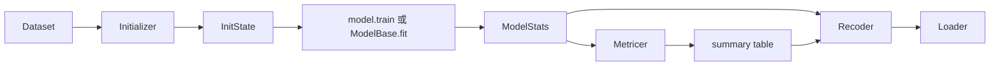
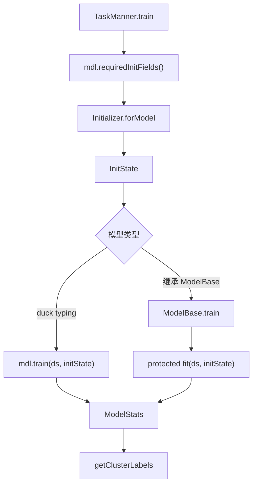
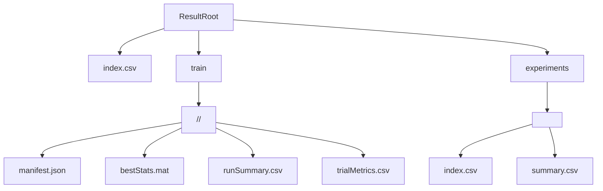

# 设计决策记录

本页记录 ExpManner 当前已经稳定下来的架构选择。它的作用不是替代源码，而是帮助维护者理解“为什么这样设计”，避免后续文档或代码改动重新引入旧假设。

## 普通文件夹风格

决策：ExpManner 使用普通 MATLAB 文件夹风格，不使用 `+ExpManner` package。

原因：

- 日常使用只需要 `addpath("<path-to-ExpManner>")`。
- 用户代码可以直接写 `Dataset(...)`、`TaskManner.train(...)`。
- 当前目标是组内聚类实验框架，而不是发布为通用 MATLAB toolbox。

维护要求：

- 文档示例不要写 `ExpManner.Dataset`。
- 新页面如果展示安装或调用方式，应继续使用短类名。

## `ModelBase` 是可选入口

决策：模型可以继续使用 duck-typed 接口，也可以继承 `ModelBase`。

原因：

- 旧项目和外部实验代码只要满足 `name`、`requiredInitFields()`、`train(ds, initState)` 就可以接入。
- 新模型如果只想实现算法主体，可以继承 `ModelBase`，只写 protected `fit(ds, initState)`。
- `ModelBase` 的价值是减少样板代码，不是强制框架依赖。

维护要求：

- `model-interface.md` 和教程不能暗示所有模型都必须继承 `ModelBase`。
- 新示例应同时尊重 duck typing 和 `ModelBase` 两条路径。

## class-folder 工具组织

决策：`Metricer` 和 `utils` 使用 MATLAB class-folder layout：`@Metricer/Metricer.m`、`@utils/utils.m` 只放声明，具体方法放在同目录独立文件。

原因：

- `Metricer` 和 `utils` 的方法数量较多，拆分后更容易审查和维护。
- 保持根目录短类名调用，不引入 package 前缀。
- 避免把图构造、指标、标签转换、assignment solver 全部混在一个工具文件里。

维护要求：

- 聚类指标和统计工具优先放在 `Metricer`。
- 标签、membership、simplex、assignment 和通用数值工具优先放在 `utils`。
- 图和核相关工具优先放在 `Dataset`。

## 结果目录分层

决策：单次 run artifact 和 experiment summary 分开保存。

```text
results/
  index.csv
  train/<model>/<dataset>/<runId>/
    manifest.json
    bestStats.mat
    runSummary.csv
    trialMetrics.csv
  experiments/<experimentName>/
    index.csv
    summary.csv
```

原因：

- 单次运行的重 artifact 和实验级汇总有不同生命周期。
- `ExperimentName` 可以表达脚本或实验主题。
- 不再生成旧式根目录 `results/summary.csv`，避免不同实验混在一起。

维护要求：

- 文档和示例不要恢复根目录 `results/summary.csv` 的说法。
- public docs 只展示规范化 `<runId>`，不要展示真实时间戳或本机路径。

## public docs 与 private code repo 分离

决策：代码仓库保持 private，文档仓库保持 public。

原因：

- public docs 可以服务授权协作者和组内新成员的入门阅读。
- private code repo 保留 canonical docs、Live Script、内部数据准备和真实实验材料。
- public docs 不应该暴露私有数据位置、未发表结果或敏感模型实现。

维护要求：

- public docs 只同步公开安全子集。
- private `docs/internal/` 可放内部材料规则和入口。
- 公开页面引用 private code repo 时，应说明需要 PALM Jia 授权。

## 训练流程图



## 模型接口调用链



## 结果目录图


